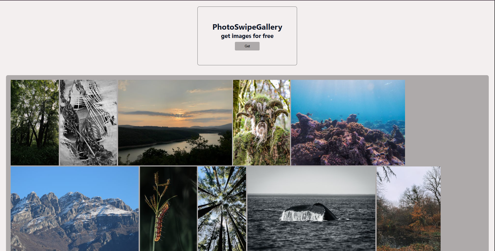
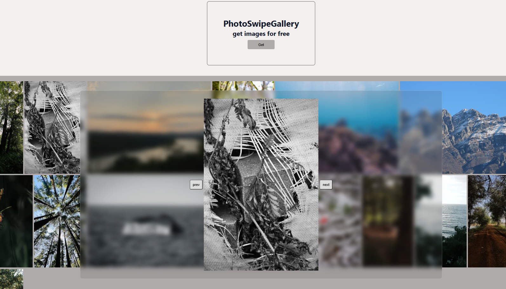
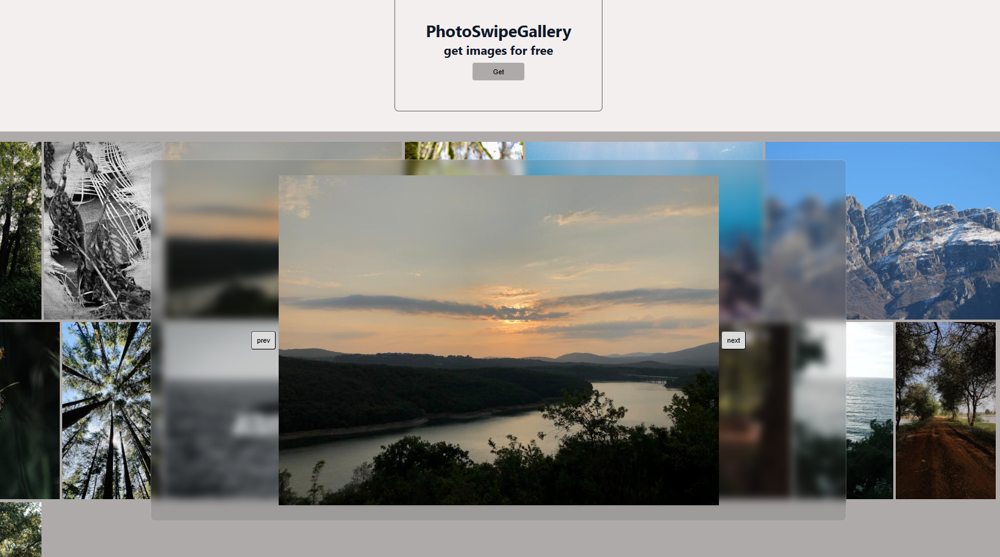
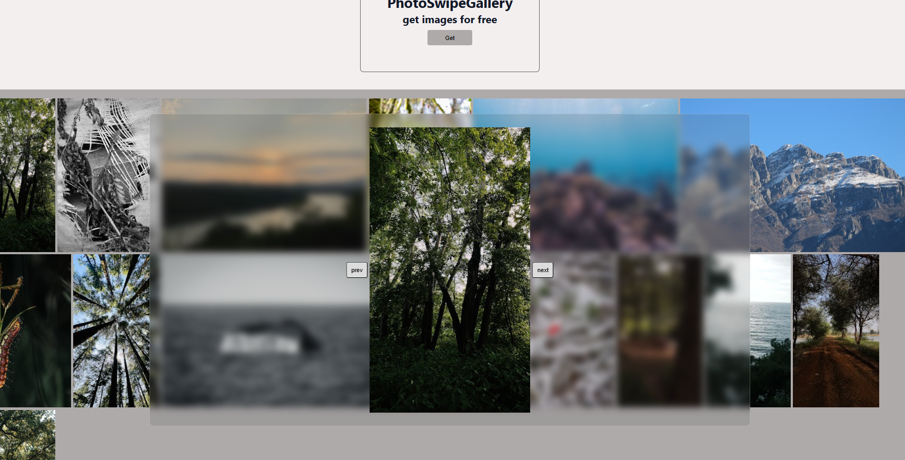

# PhotoSwipeGallery

## Overview

PhotoSwipeGallery is a simple JavaScript image gallery that fetches nature images from an image API and displays them dynamically on the page.

Users can:

* Load images with a button click
* View all fetched images in a responsive gallery
* Double-click any image to open a larger version
* Navigate through images using Previous and Next buttons
* Close the zoomed image view by clicking outside the modal

---

## Features

### Dynamic Image Loading

Images are fetched asynchronously using the Fetch API and rendered dynamically into the DOM.

### Gallery View

All fetched images are displayed inside a flexible image container using JavaScript-generated `` elements.

### Image Zoom

Double-clicking an image opens a larger version of that image inside a modal.

### Image Navigation

Users can browse through loaded images without returning to the gallery using:

* Previous button
* Next button

### Modal Close

The modal closes when the user clicks outside the image area.

---

## JavaScript Logic

### 1. DOM References

The application first stores references to important HTML elements.

```javascript
const btnREF = document.getElementById("img-btn");
const imgContREF = document.getElementById("image-container");
const zoomImgcont = document.getElementById("modal");
const zoomImg = document.getElementById("modal-image");
const nextBtn = document.getElementById("nextBtn");
const prevBtn = document.getElementById("prevBtn");
```

These references allow JavaScript to manipulate the UI.

---

### 2. State Variables

```javascript
let photo = [];
let currentIndex = 0;
```

#### photo

Stores all fetched image objects from the API.

Example:

```javascript
photo = [
  {...},
  {...},
  {...}
];
```

This array becomes the application's image database.

#### currentIndex

Tracks which image is currently selected in the modal.

Example:

```javascript
currentIndex = 5;
```

This means the sixth image in the gallery is currently open.

---

### 3. Fetching Images

When the Get button is clicked:

```javascript
btnREF.addEventListener("click", async () => {
```

the application:

1. Sends a request to the API.
2. Converts the response into JSON.
3. Stores all image objects inside `photo`.
4. Dynamically creates image elements.

---

### 4. Rendering Images

For each image object:

```javascript
data.photos.forEach((item, index) => {
```

the application:

* Creates an `` element.
* Assigns the image URL.
* Appends it to the gallery container.

```javascript
image.src = item.src.medium;
imgContREF.append(image);
```

---

### 5. Opening the Modal

Each generated image receives its own double-click listener.

```javascript
image.addEventListener("dblclick", () => {
```

When triggered:

```javascript
zoomImg.src = item.src.large;
currentIndex = index;
```

The application:

1. Displays a larger image.
2. Stores the selected image index.
3. Opens the modal.

This index is essential for image navigation.

---

### 6. Next Button

```javascript
nextBtn.addEventListener("click", () => {
```

When clicked:

```javascript
currentIndex++;
zoomImg.src = photo[currentIndex].src.large;
```

The application moves to the next image using the stored array.

---

### 7. Previous Button

```javascript
prevBtn.addEventListener("click", () => {
```

When clicked:

```javascript
currentIndex--;
zoomImg.src = photo[currentIndex].src.large;
```

The application moves to the previous image.

---

### 8. Closing the Modal

A click listener is attached to the window.

```javascript
window.addEventListener("click", (e) => {
```

The modal closes only when the overlay itself is clicked.

```javascript
if (e.target === zoomImgcont) {
    zoomImgcont.classList.remove("overlay");
}
```

This prevents accidental closing while interacting with the image or navigation buttons.

---

## Concepts Practiced

This project demonstrates:

* Fetch API
* Async/Await
* JSON Handling
* Arrays of Objects
* DOM Manipulation
* Dynamic Element Creation
* Event Listeners
* State Management
* Modal UI Design
* Image Gallery Navigation

---

## Future Improvements

* Prevent duplicate image loading
* Add loading spinner
* Keyboard navigation (Arrow Keys)
* Image search functionality
* Infinite scrolling
* Touch swipe support
* Boundary handling for first and last images
* Dark mode support
* Image lazy loading

---

## Tech Stack

* HTML5
* CSS3
* JavaScript (Vanilla JS)
* Fetch API

##  ScreenShots

# UI


# current


# next btn


# previous btn
